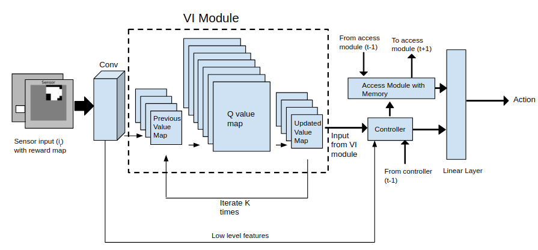

# macn-gym-pathfinding
Memory Augmented Control Network implementation for gym-pathfinding

## Architecture

  

## Benchmark (WIP)

Test | 8x8 | 16x16 | 28x28
-- | -- | -- | --
Test Error | XX.XX% | XX.XX% | XX.XX%
Success(%) | XX.XX% | XX.XX% | XX.XX%

## Reference 

[Memory Augmented Control Network paper](https://arxiv.org/abs/1709.05706)

